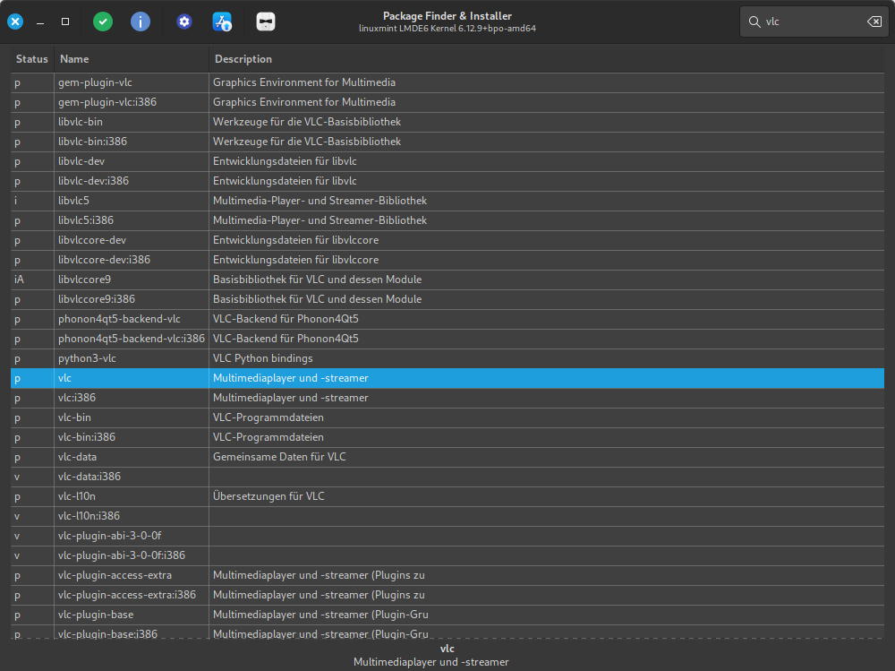
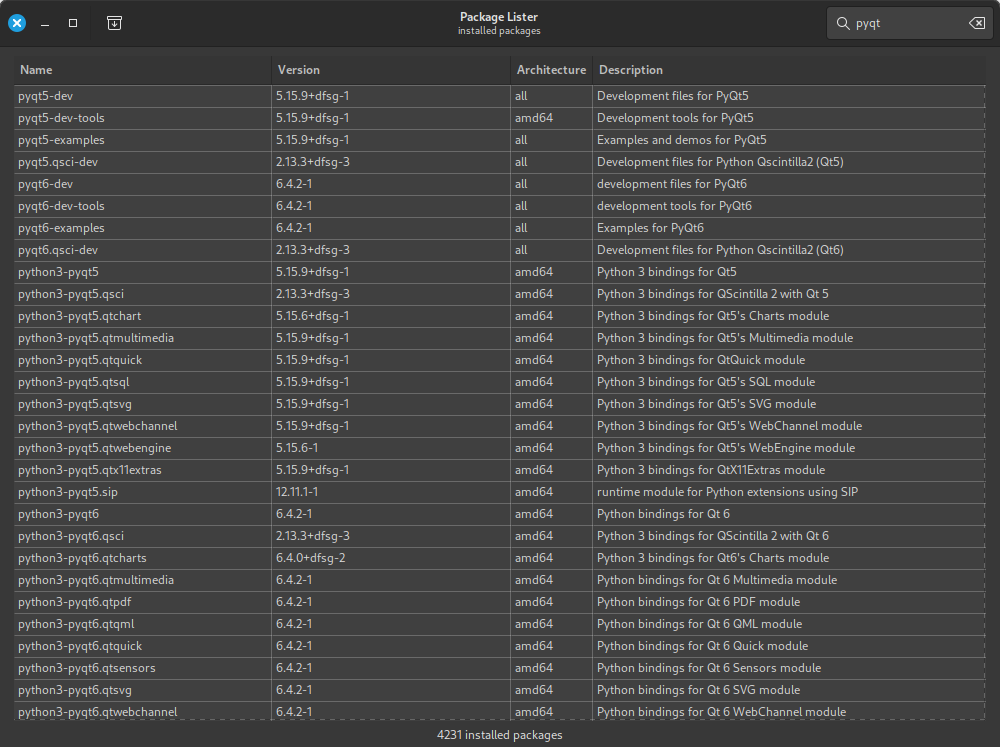

# MintPackageFinder
find and install packages in Linux Mint 22 / LMDE6

- search for packages
- install selected package (is made by [aptkit](https://github.com/linuxmint/aptkit))
- show package information
- show installed packages (with filter)
- toggle light / dark theme

## Requirements
- python3
- [gi repository](https://pypi.org/project/PyGObject/)
- Linux Mint 22 or LMDE6

## Usage

```python3 apt_finder.py```




