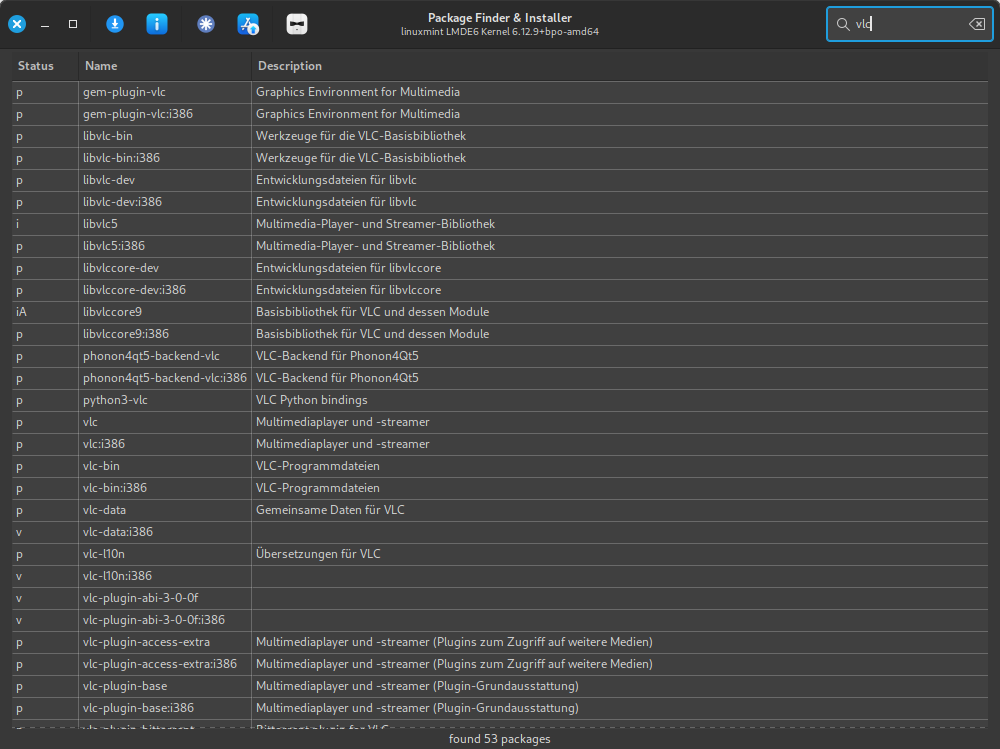

# MintPackageFinder
find and install packages in Linix Mint 22 / LMDE6

- search for packages
- install selected package (is made by aptkit)
- show package information
- show installed packages (with filter)
- toggle light / dark theme

## Requirements
- python3
- gi repository

## Usage

```python3 apt_finder.py```




